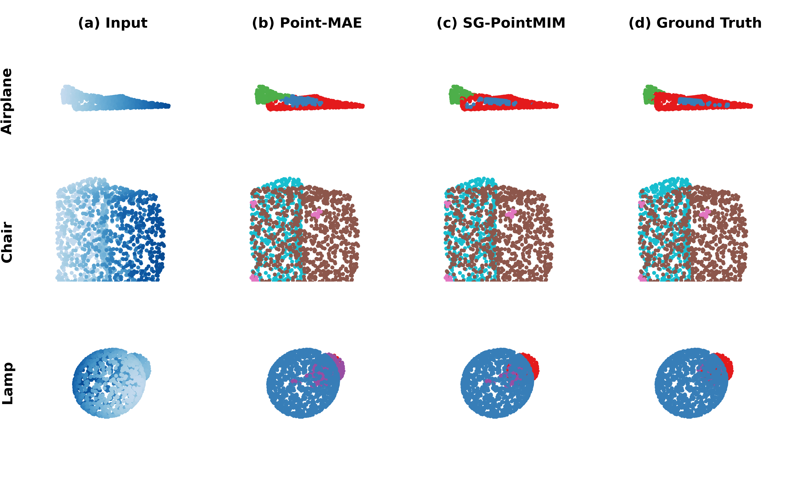

# SG-PointMIM

<p align="center">
  <strong>Spectral Self-Guided Masking and Dual-Target Reconstruction for Point Cloud Representation Learning</strong>
</p>

<p align="center">
  Xin Cao, Yinan Wang, Linrong Ye, Jiaxu Shi, Linzhi Su, Xingxing Hao, Fengjun Zhao<br>
  School of Computer Science, Northwest University, Xi'an, China
</p>

<p align="center">
  <a href="https://github.com/wyn-1121/SG-Pointmim"></a>
  
  
  
</p>

SG-PointMIM is a self-supervised masked point modeling framework for learning transferable 3D point-cloud representations. It replaces content-agnostic random masking with **Spectral Self-Guided Masking (SGM)** and combines coordinate reconstruction with teacher-guided latent alignment through a **Dual-Target Reconstruction** objective.

The resulting representation preserves fine-grained geometry while remaining semantically discriminative. SG-PointMIM reaches **93.7%** accuracy on ModelNet40, **88.1%** on the challenging ScanObjectNN PB-T50-RS split, **84.8%** class mIoU on ShapeNetPart, and **61.4%** mIoU on S3DIS Area 5.

## Highlights

- **Topology-aware masking.** SGM builds a patch affinity graph and uses spectral partitioning to identify structurally salient, spatially coherent regions.
- **Curriculum-guided pre-training.** Training begins with random masking and activates SGM after the teacher representation becomes stable.
- **Geometry-semantic synergy.** A geometric decoder reconstructs masked point coordinates, while a semantic decoder aligns masked predictions with momentum-teacher features.
- **Strong transferability.** The same pre-trained representation transfers to object classification, few-shot classification, part segmentation, and indoor semantic segmentation.
- **Single-GPU pre-training.** The paper configuration was trained for 300 epochs on one NVIDIA RTX 4090.

## Method

Given a point cloud, SG-PointMIM first divides it into local patches using farthest point sampling and k-nearest-neighbor grouping. A momentum teacher processes the complete patch set and serves two roles:

1. It constructs a feature-affinity graph whose Fiedler vector partitions the object into topologically coherent regions. High-relevance patches are selected for masking, with a small number retained as hint tokens.
2. It provides stable latent targets for the semantic reconstruction stream.

The student processes only the visible patches. Two lightweight Transformer decoders then reconstruct complementary targets:

- **Geometric stream:** masked patch coordinates, optimized with Chamfer Distance.
- **Semantic stream:** normalized teacher features, optimized with mean squared error.

The final objective is

$$
\mathcal{L}_{\mathrm{total}} = \alpha\mathcal{L}_{\mathrm{sem}} + \beta\mathcal{L}_{\mathrm{geo}},
$$

with \(\alpha=1.0\) and \(\beta=20.0\) in the paper configuration.

## Main Results

### Object classification

| Dataset / split | Metric | SG-PointMIM |
|---|---:|---:|
| ModelNet40 | Accuracy | **93.7** |
| ScanObjectNN OBJ-BG | Accuracy | **92.3** |
| ScanObjectNN OBJ-ONLY | Accuracy | **92.1** |
| ScanObjectNN PB-T50-RS | Accuracy | **88.1** |

### Few-shot classification on ModelNet40

Results are the mean accuracy and standard deviation over 10 independent runs.

| Setting | SG-PointMIM |
|---|---:|
| 5-way 10-shot | **97.2 ± 2.5** |
| 5-way 20-shot | **98.7 ± 1.1** |
| 10-way 10-shot | **92.7 ± 4.4** |
| 10-way 20-shot | **95.9 ± 3.3** |

### Point-cloud segmentation

| Dataset / protocol | Metric | SG-PointMIM |
|---|---:|---:|
| ShapeNetPart | Class mIoU | **84.8** |
| ShapeNetPart | Instance mIoU | **86.1** |
| S3DIS Area 5 | Mean accuracy | **70.5** |
| S3DIS Area 5 | mIoU | **61.4** |

### Qualitative part segmentation

<p align="center">
  
</p>

SG-PointMIM produces cleaner predictions around fine-grained part boundaries than the Point-MAE baseline.

## Repository Structure

```text
SG-Pointmim/
├── cfgs/                         # Pre-training and downstream configurations
│   └── dataset_configs/          # Dataset paths and dataset-specific settings
├── datasets/                     # Dataset loaders and few-shot split generation
├── models/                       # SG-PointMIM and downstream Transformer models
├── segmentation/                 # ShapeNetPart and S3DIS experiments
├── tools/                        # Training, fine-tuning, and evaluation runners
├── utils/                        # Configuration, logging, checkpoint, and distributed utilities
├── main.py                       # Main entry point
└── requirements.txt
```

## Installation

Clone the repository:

```bash
git clone https://github.com/wyn-1121/SG-Pointmim.git
cd SG-Pointmim
```

### 1. Create an environment

Python 3.8 is recommended because the repository pins several older research dependencies.

```bash
conda create -n sg-pointmim python=3.8 -y
conda activate sg-pointmim
```

### 2. Install PyTorch and Python dependencies

Install a CUDA-enabled PyTorch build that matches your local CUDA toolkit, then install the remaining packages:

```bash
# Select the appropriate PyTorch command from https://pytorch.org/get-started/locally/
pip install torch torchvision
pip install -r requirements.txt
pip install scikit-learn
```

### 3. Install CUDA operators

The training code requires the following CUDA operators:

- `knn_cuda`
- `pointnet2_ops`
- Chamfer Distance (`extensions.chamfer_dist`)

The current source snapshot does not vendor these operators. Install compatible implementations before training. The extension layout used by the code follows the [Point-MAE](https://github.com/Pang-Yatian/Point-MAE) codebase.

> **Release note:** this is an initial research-code release. Before running the current snapshot, align the pre-training model import, registry decorator, and `model.NAME` entry with the implementation in `models/sg_pointmim.py`. Pre-trained checkpoints, a public paper URL, and self-contained CUDA extension build scripts are not yet included. They will be added in a future update.

## Data Preparation

Download the datasets and arrange them as follows, or update the corresponding paths in `cfgs/dataset_configs/*.yaml`.

```text
data/
├── ShapeNet55-34/
│   ├── ShapeNet-55/
│   │   ├── train.txt
│   │   └── test.txt
│   └── shapenet_pc/
├── ModelNet/
│   └── modelnet40_normal_resampled/
├── ModelNetFewshot/
│   ├── 5way_10shot/
│   ├── 5way_20shot/
│   ├── 10way_10shot/
│   └── 10way_20shot/
├── ScanObjectNN/
│   ├── main_split/
│   └── main_split_nobg/
└── shapenetcore_partanno_segmentation_benchmark_v0_normal/
```

Useful sources:

- ShapeNet-55 and the expected pre-training layout: [Point-MAE data preparation](https://github.com/Pang-Yatian/Point-MAE/blob/main/DATASET.md)
- ModelNet40 and ShapeNetPart: [PointNet++ data resources](https://github.com/charlesq34/pointnet2)
- ScanObjectNN: [official repository](https://github.com/hkust-vgd/scanobjectnn)
- S3DIS: [Stanford 3D Indoor Spaces dataset](http://buildingparser.stanford.edu/dataset.html)

To generate the ModelNet40 few-shot splits after preparing ModelNet40:

```bash
cd datasets
python generate_few_shot_data.py
cd ..
```

## Pre-training

The paper configuration uses the following settings:

| Setting | Value |
|---|---:|
| Input points | 1,024 |
| Number of patches | 64 |
| Points per patch | 32 |
| Mask ratio | 0.60 |
| SGM start epoch | 100 |
| Hint ratio | 0.10 |
| Encoder | 12 layers, 384 dimensions, 6 heads |
| Decoders | 4 layers, 384 dimensions, 6 heads |
| Epochs | 300 |
| Batch size | 256 |
| Optimizer | AdamW |
| Learning rate | 1e-3 |
| Weight decay | 0.05 |
| Loss weights | \(\alpha=1.0,\ \beta=20.0\) |

To reproduce the full SG-PointMIM model, enable SGM in `cfgs/pretrain.yaml`:

```yaml
transformer_config:
  use_sgm: True
  sgm_start_epoch: 100
  sgm_hint_ratio: 0.1
```

Single-GPU training:

```bash
python main.py \
  --config cfgs/pretrain.yaml \
  --exp_name sg_pointmim_pretrain
```

Distributed training:

```bash
torchrun --nproc_per_node=NUM_GPUS main.py \
  --launcher pytorch \
  --config cfgs/pretrain.yaml \
  --exp_name sg_pointmim_pretrain
```

Resume an interrupted experiment:

```bash
python main.py \
  --config cfgs/pretrain.yaml \
  --exp_name sg_pointmim_pretrain \
  --resume
```

Logs, TensorBoard events, and checkpoints are written under `experiments/`.

## Fine-tuning and Evaluation

Set `PRETRAINED_CKPT` to the SG-PointMIM pre-training checkpoint.

### ModelNet40

```bash
python main.py \
  --config cfgs/finetune_modelnet.yaml \
  --finetune_model \
  --ckpts PRETRAINED_CKPT \
  --exp_name finetune_modelnet40
```

### ScanObjectNN PB-T50-RS

```bash
python main.py \
  --config cfgs/finetune_scan_hardest.yaml \
  --finetune_model \
  --ckpts PRETRAINED_CKPT \
  --exp_name finetune_scanobjectnn_pb_t50_rs
```

The OBJ-BG and OBJ-ONLY settings use `cfgs/finetune_scan_objbg.yaml` and `cfgs/finetune_scan_objonly.yaml`, respectively.

### Evaluate a fine-tuned checkpoint

```bash
python main.py \
  --config cfgs/finetune_scan_hardest.yaml \
  --test \
  --ckpts FINETUNED_CKPT \
  --exp_name eval_scanobjectnn_pb_t50_rs
```

### Few-shot classification

```bash
python main.py \
  --config cfgs/fewshot.yaml \
  --finetune_model \
  --ckpts PRETRAINED_CKPT \
  --way 5 \
  --shot 10 \
  --fold 0 \
  --exp_name fewshot_5way_10shot_fold0
```

Use `--way {5,10}`, `--shot {10,20}`, and `--fold {0,...,9}` to reproduce all reported few-shot settings.

## Segmentation

### ShapeNetPart

```bash
cd segmentation
python main.py \
  --gpu 0 \
  --root ../data/shapenetcore_partanno_segmentation_benchmark_v0_normal/ \
  --ckpts PRETRAINED_CKPT \
  --log_dir sg_pointmim
```

### S3DIS Area 5

First preprocess S3DIS following the scripts in `segmentation/S3DIS_segmentation/data_utils/`, then run:

```bash
cd segmentation/S3DIS_segmentation
python train_semseg.py \
  --gpu 0 \
  --test_area 5 \
  --root /path/to/stanford_indoor3d/ \
  --ckpts PRETRAINED_CKPT \
  --log_dir sg_pointmim_area5
```

Some segmentation scripts retain machine-specific GPU or data-path defaults from the research environment. Review their command-line defaults before launching an experiment.

## Checkpoints

Pre-trained and downstream checkpoints are not yet part of this release. Download links and model hashes will be added here when the artifacts are published.

## Citation

If this work is useful for your research, please cite it. The bibliographic entry will be updated after publication.

```bibtex
@article{cao2026sgpointmim,
  title   = {SG-PointMIM: Spectral Self-Guided Masking and Dual-Target Reconstruction for Point Cloud Representation Learning},
  author  = {Cao, Xin and Wang, Yinan and Ye, Linrong and Shi, Jiaxu and Su, Linzhi and Hao, Xingxing and Zhao, Fengjun},
  journal = {Submitted to IEEE Journals},
  year    = {2026}
}
```

## Acknowledgements

This repository builds on ideas and components from the point-cloud self-supervised learning community, especially [Point-MAE](https://github.com/Pang-Yatian/Point-MAE). We thank the authors of the referenced projects and dataset maintainers for making their work publicly available.

## Contact

For questions, please open a GitHub issue or contact the corresponding authors at `sulinzhi029@163.com`.
